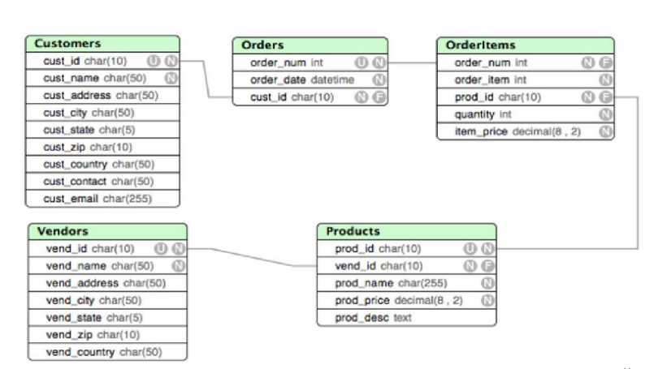

# SQL in Oracle RDBMS
Here you can take a look how I decide some tasks about DBs. I took these tasks from my university course.

#### Database structure


#### What is the cheapest product?
```sql
SELECT * FROM PRODUCTS 
WHERE PROD_PRICE IN (
	SELECT min(PROD_PRICE) FROM PRODUCTS
)
```


#### Show all products that have ever been ordered without repeating
```sql
SELECT distinct(PROD_NAME) FROM PRODUCTS P
INNER JOIN ORDERITEMS OI
ON P.PROD_ID = OI.PROD_ID
```


#### Which vendors did the Village Toys customer order the products from?
```sql
SELECT VEND_NAME FROM VENDORS 
WHERE VEND_ID IN (
	SELECT VEND_ID FROM PRODUCTS 
	WHERE PROD_ID IN(
		SELECT distinct(PROD_ID) FROM ORDERITEMS 
			WHERE ORDER_NUM IN (
				SELECT ORDER_NUM FROM ORDERS 
				WHERE CUST_ID IN (
					SELECT CUST_ID FROM CUSTOMERS 
					WHERE CUST_NAME = 'Village Toys'
				)
			)
	)
)
```


#### Which customers have never bought?
```sql
SELECT * FROM CUSTOMERS C
LEFT JOIN ORDERS O 
ON C.CUST_ID = O.CUST_ID
WHERE O.CUST_ID IS NULL
```


#### Which vendor do customers buy the most products from?
```sql
SELECT VEND_NAME FROM (
    SELECT VEND_NAME, SUM(QUANTITY) as"TOTAL" FROM ORDERITEMS OI 
    LEFT JOIN PRODUCTS P
    ON OI.PROD_ID = P.PROD_ID
        LEFT JOIN VENDORS V 
        ON P.VEND_ID = V.VEND_ID
    GROUP BY VEND_NAME 
    ORDER BY"TOTAL" DESC
    FETCH FIRST 1 ROWS ONLY
)
```


#### How sum did each customer order?
```sql
SELECT CUST_NAME, sum(QUANTITY * ITEM_PRICE) as"Total earn" FROM CUSTOMERS C
LEFT JOIN ORDERS O
ON C.CUST_ID = O.CUST_ID
	LEFT JOIN ORDERITEMS OI
	ON O.ORDER_NUM = OI.ORDER_NUM
GROUP BY CUST_NAME
```


#### Which customer has the largest number of orders?
```sql
SELECT CUST_NAME, sum(QUANTITY) as"Total QUANTITY" FROM CUSTOMERS C
LEFT JOIN ORDERS O
ON C.CUST_ID = O.CUST_ID
	RIGHT JOIN ORDERITEMS OI
	ON O.ORDER_NUM = OI.ORDER_NUM
GROUP BY CUST_NAME 
ORDER BY"Total QUANTITY" DESC
FETCH FIRST 1 ROWS ONLY
```


#### Remove Fun4All client from the database. Need ensure the referential integrity of the database
```sql
DELETE FROM ORDERITEMS
WHERE ORDER_NUM IN (
	SELECT ORDER_NUM FROM ORDERS 
	WHERE CUST_ID IN (
		SELECT CUST_ID FROM CUSTOMERS 
		WHERE CUST_NAME = 'Fun4All'
	)
);

DELETE FROM ORDERS 
WHERE CUST_ID IN (
	SELECT CUST_ID FROM CUSTOMERS 
	WHERE CUST_NAME = 'Fun4All'
);

DELETE FROM CUSTOMERS WHERE CUST_NAME = 'Fun4All';
```
